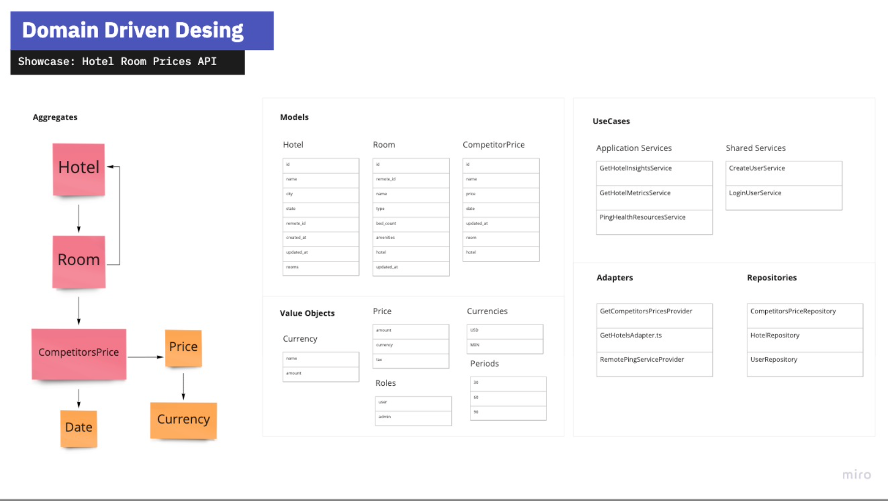

# guru-hotel-challenge
Backend - Internal tools

<!-- 

 -->

[A PDF documentation ](docs/hotel-room-prices-api.pdf)

[Miro Diagram](https://miro.com/app/board/uXjVOLJ2_yk=/?invite_link_id=942219701434 "Miro Diagram")

##### Running app

 You need only run ` docker-compose up -d --build `  for running from container
 
 Running locally  ` yarn dev`   or  `npm run dev`
 
 
 

##### Env Files

 There are 3 diferentes .env files, you can change the values in order to set  local enviroments values, docker env file is for runing docker composer with differentes settings

env example

	APP_PORT=3000
	APP_SECRET=D810B6518556468A10548A292EF12C37BF5F2D42
	API_URL = http://external-api:5000
	TYPEORM_CONNECTION = mongodb
	TYPEORM_HOST = mongo-server
	TYPEORM_DATABASE = hotel-price-api
	TYPEORM_PORT = 27017
	TYPEORM_SYNCHRONIZE = true
	TYPEORM_LOGGING = true
	TYPEORM_ENTITIES = src/**/*.entity.ts,dist/src/**/*.entity.d.ts
	TYPEORM_USER_UNIFIED_TOPOLOGY=TRUE
	

